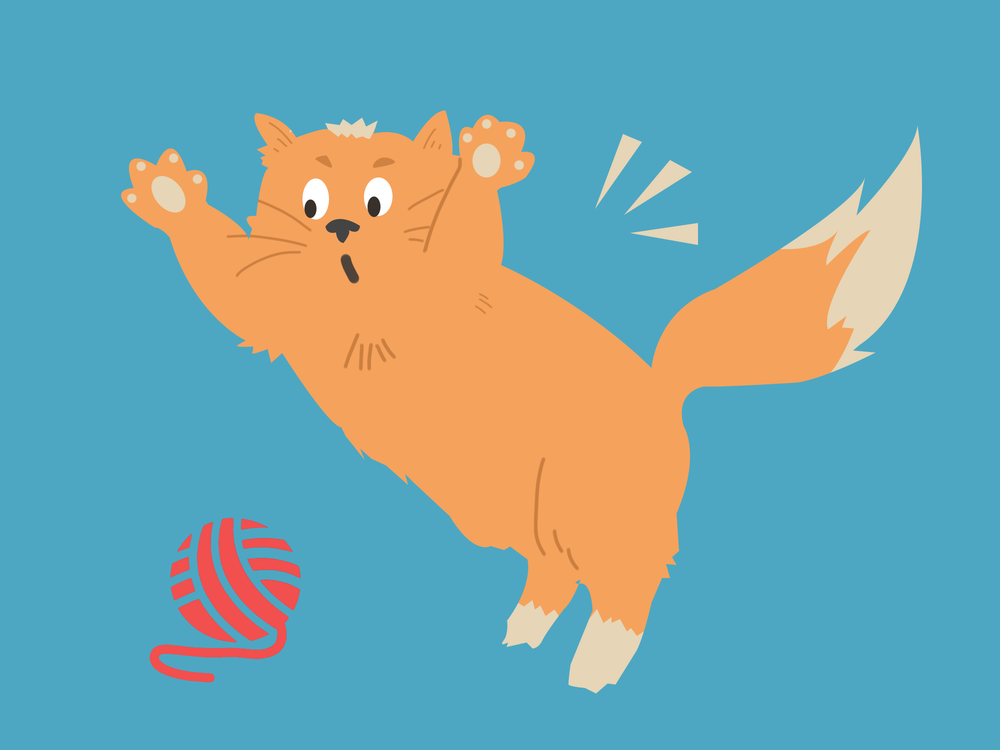
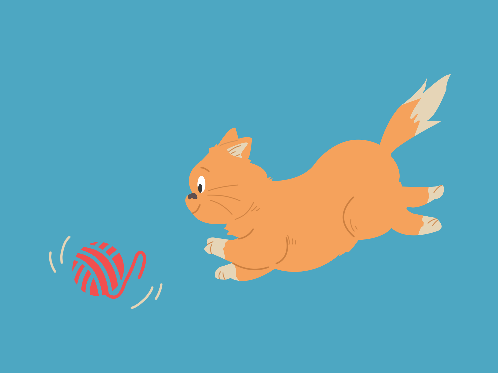

[//]: # ( ns__file unit: standard, comp: README.md )

[//]: # ( ns__custom_start beginning )

[//]: # ( ns__custom_end beginning )

[//]: # ( ns__start_section intro )

[//]: # ( ns__custom_start description )


Build a generator that uses [geenee](https://www.npmjs.com/package/geenee) based on a model code base.  

[//]: # ( ns__custom_end description )

[//]: # ( ns__custom_start afterDescription )


[//]: # ( ns__custom_end afterDescription )

[//]: # ( ns__custom_start badges )

[//]: # ( ns__start_section usageSection )
[](https://oclif.io)
[](https://npmjs.org/package/copykat)
[](https://npmjs.org/package/copykat)
[](https://github.com//blob/master/package.json)

[//]: # ( ns__custom_end badges )

[//]: # ( ns__end_section intro )


[//]: # ( ns__custom_start beforeToc )
To create your own generator, make a local copy of a code base that you like and then call `copykat pounce $MODEL` and follow the directions.

The generators use [geenee](https://www.npmjs.com/package/geenee), a re-generator tool.  That means that you can release your generator and then make changes as needed.  Whenever you update it,
your users can apply them without losing their custom changes.  See more complete instructions below in [Usage](#usage).

For an example, see [easy-oclif-cli](https://www.npmjs.com/package/easy-oclif-cli).

[//]: # ( ns__custom_end beforeToc )

[//]: # ( ns__custom_start toc )
<!-- toc -->
* [:wrench: Usage](#wrench-usage)
* [:zap: Commands](#zap-commands)
<!-- tocstop -->

[//]: # ( ns__custom_end toc )

[//]: # ( ns__custom_start usage )
# :wrench: Usage
## (1) Create a Template with pounce

To create the template, define:
1. **MODEL_DIR** a directory for the code that will be the basis for your generator
2. **TEMPLATE_DIR** the directory for your template

Then, run
```
copycat pounce $MODEL_DIR -t $TEMPLATE_DIR
```
and follow the directions.

(2) Hone the results with chase

```
copycat chase $TEMPLATE_DIR
```
You will be directed through the process.

<!-- usage -->
```sh-session
$ npm install -g copykat
$ copykat COMMAND
running command...
$ copykat (-v|--version|version)
copykat/0.1.5 win32-x64 node-v14.15.5
$ copykat --help [COMMAND]
USAGE
  $ copykat COMMAND
...
```
<!-- usagestop -->


[//]: # ( ns__custom_end usage )

[//]: # ( ns__end_section usageSection )


[//]: # ( ns__start_section commandsSection )
# :zap: Commands


[//]: # ( ns__custom_start commands )
<!-- commands -->
* [`copykat chase TEMPLATEDIR`](#copykat-chase-templatedir)
* [`copykat help [COMMAND]`](#copykat-help-command)
* [`copykat pounce MODEL`](#copykat-pounce-model)

## `copykat chase TEMPLATEDIR`

compare generated code to your model, changing both until you've replicated the model with your template

```
USAGE
  $ copykat chase TEMPLATEDIR

ARGUMENTS
  TEMPLATEDIR  the path to your template

OPTIONS
  -h, --help  show CLI help

EXAMPLE
  $ copykat chase sampleTemplateDir
```

_See code: [src/commands/chase.ts](https://github.com/YizYah/copykat/blob/v0.1.5/src/commands/chase.ts)_

## `copykat help [COMMAND]`

display help for copykat

```
USAGE
  $ copykat help [COMMAND]

ARGUMENTS
  COMMAND  command to show help for

OPTIONS
  --all  see all commands in CLI
```

_See code: [@oclif/plugin-help](https://github.com/oclif/plugin-help/blob/v3.2.1/src/commands/help.ts)_

## `copykat pounce MODEL`

specify a model code base and generate a template to build it

```
USAGE
  $ copykat pounce MODEL

ARGUMENTS
  MODEL  path to a model code base from which you will generate your template

OPTIONS
  -h, --help                     show CLI help
  -t, --templateDir=templateDir  path to the generator that you will build

EXAMPLE
  $ copykat pounce sampleModel -t sampleTemplateDir
```

_See code: [src/commands/pounce.ts](https://github.com/YizYah/copykat/blob/v0.1.5/src/commands/pounce.ts)_
<!-- commandsstop -->

[//]: # ( ns__custom_end commands )

[//]: # ( ns__end_section commandsSection )
